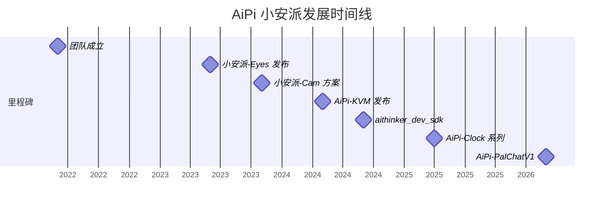
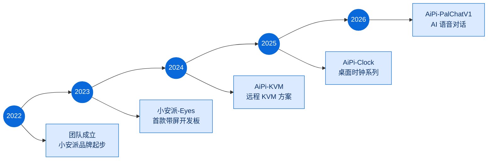

# 替代方案对照

## G gantt 里程碑

```mermaid
gantt
    title AiPi 小安派发展时间线
    dateFormat YYYY-MM-DD
    axisFormat %Y
    section 里程碑
    团队成立            :milestone, m1, 2022-03-01, 0d
    小安派-Eyes 发布     :milestone, m2, 2023-06-01, 0d
    小安派-Cam 方案      :milestone, m3, 2023-11-01, 0d
    AiPi-KVM 发布        :milestone, m4, 2024-05-01, 0d
    aithinker_dev_sdk   :milestone, m5, 2024-09-01, 0d
    AiPi-Clock 系列      :milestone, m6, 2025-04-01, 0d
    AiPi-PalChatV1      :milestone, m7, 2026-03-01, 0d
```

## F flowchart 时间轴

```mermaid
flowchart LR
    classDef y fill:#0969da,color:#ffffff,stroke:#0969da
    classDef e fill:#dbeafe,color:#0a3069,stroke:#0969da
    Y22((2022)):::y --> Y23((2023)):::y --> Y24((2024)):::y --> Y25((2025)):::y --> Y26((2026)):::y
    Y22 --> E1[团队成立<br/>小安派品牌起步]:::e
    Y23 --> E2[小安派-Eyes<br/>首款带屏开发板]:::e
    Y24 --> E3[AiPi-KVM<br/>远程 KVM 方案]:::e
    Y25 --> E4[AiPi-Clock<br/>桌面时钟系列]:::e
    Y26 --> E5[AiPi-PalChatV1<br/>AI 语音对话]:::e
```
